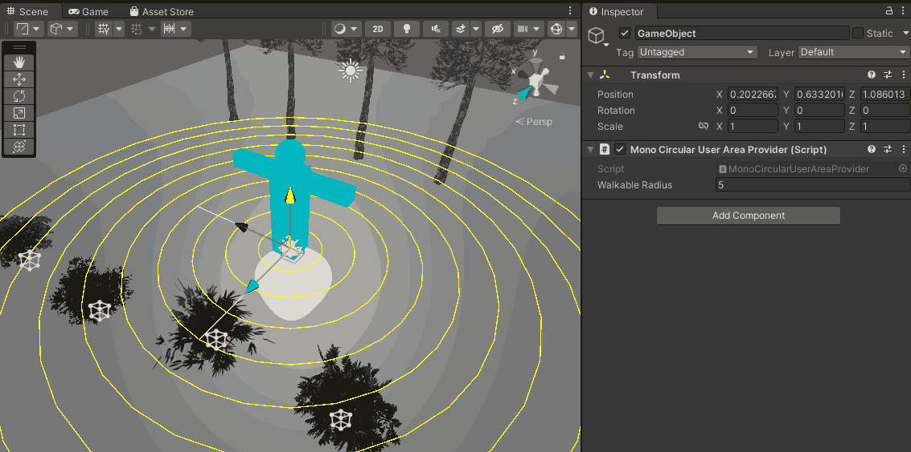
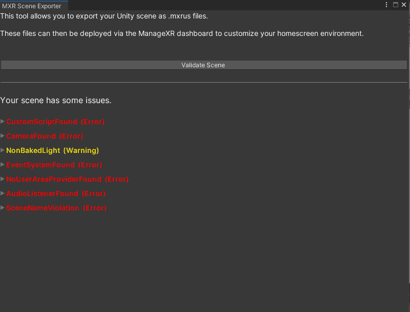
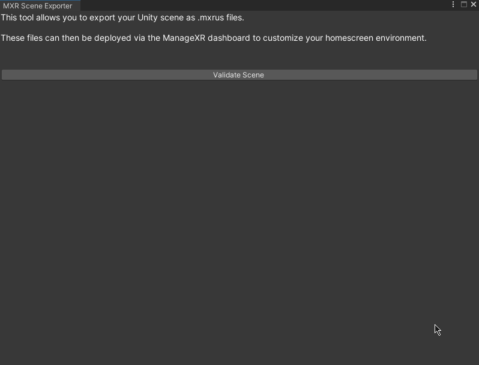
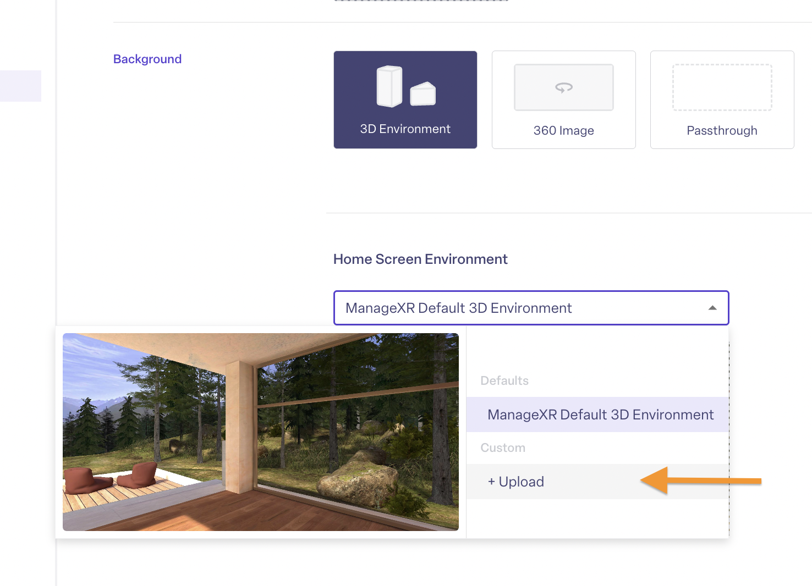

### Start your project
* Create (or open) a Unity project. Ensure the Unity version is **Unity 2021.3 or below**
* Import the URP `12.1.14` package
* Create a URP Asset in your Project view using `Right Click > Create > Rendering > URP Asset (with Universal Renderer)`
* Set the URP Asset in your Graphics Settings by going to `Project Settings > Graphics > Scriptable Render Pipeline Settings`

<Tip>
**Don't normally use URP?**
Learn about a [common issue moving from Built-In to URP](../3d-environment-sdk-reference/advanced#built-in-to-urp-gotchas) and how to avoid it.
</Tip>

### Create your environment
1. Use the Unity workflow to design your scene
2. Set the user's location and walkable area within your environment:

    a. **Create a GameObject** and add the `MonoCircularUserAreaProvider` component to it.
    
    b. **Ensure that Gizmos are enabled** in your Scene view. You should see a blue avatar with concentric circles around it. The position and rotation of the avatar determine the location and direction the user will start at. The VR Home Screen menu will appear in front of the user when they are in this position in your environment.
    
    c. **Change the `Walkable Radius` value of the `MonoCircularUserAreaProvider` component**. The concentric circles will update to reflect the new value. Set this value to match the area you want the user to be able to walk around in.

<Tip>
**Important Design Tips**

Since your Unity scene will run on standalone VR headsets, ensure that the scene is optimized for mobile devices. 
    * Try to keep your triangle count low
    * Use mobile friendly shaders
    * Bake lighting as much as possible
    * Avoid very complex particle systems with high particle count 
    * Try to keep your draw calls/batches low.

</Tip> 

    
### Validate and export your scene
1. Go to `Unity toolbar > MXR > Scene Exporter`. A window titled `MXR Scene Exporter` will open.
2. Click on the `Validate` button. This will validate your scene and violations (if any) in your scene will be highlighted. Click on an issue to expand it. A brief description and any relevant GameObject or Asset will be shown.
    * Issues shown in red will _prevent_ export unless you address them
    * Issues shown in yellow are warnings which don't prevent exporting but highlight potential compatibility or performance problems.
    * [View the list of possible validation issues](../3d-environment-sdk-reference/limitations#validation-issue-details) and recommended fixes

If you have no export-preventing issues, click the `Export Scene` button to export the file ✅

### Check the size and optimize
Now that you've exported your scene, it's time to verify that the size of your environment is within the **recommended size limit of 30MB**.

Once your `mxrus` file has finished building and has exported, you'll see a **build report** that will show the different assets that have been packaged. Use the build report to verify the size of your environment and identify large assets to optimize or remove:

<Tip>
**Build Report Tips**
* Click on an asset to highlight it in your Project view so that you can easily locate it. 
* Use the asset type dropdown to review different assets such as shaders, textures, meshes and more.
</Tip>

See the Advanced section for more tips on reducing export size.

### Deploy on ManageXR

To upload and deploy your custom 3D environment on ManageXR:
1. Go to the **Configurations** tab
2. Select your configuration
3. Select **Device Experience** - Note, you must be using Custom Home, Kiosk App, or Kiosk Video
4. Under the home screen preview image, select **Logo & Background**
5. Scroll down to Background. Select **3D Environment**
6. Click on the dropdown and select **+ Custom**
7. Drag and drop your environment file
8. Give it a nickname 
9. Press **Upload**
10. **Save Changes** on your configuration

<Check>The next time your devices come online, they will download and begin using your custom 3D environment! Note, you can re-use this environment on other configurations without re-uploading it.</Check>