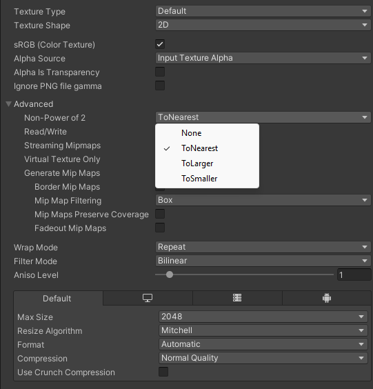
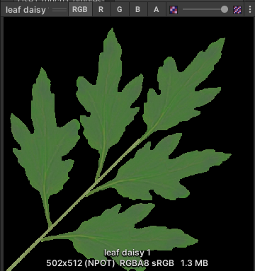
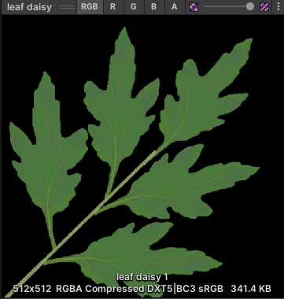
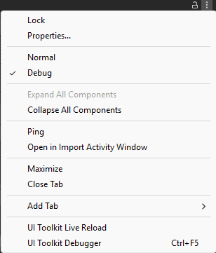
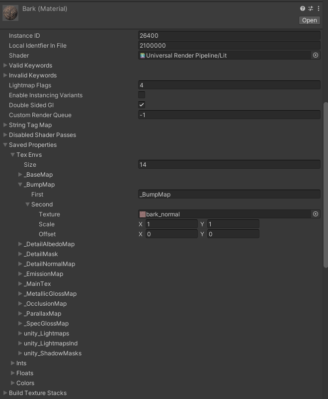

## 🔍 What's inside an mxrus file?
The .mxrus format is a .zip renamed comprising of AssetBundles and some metadata files. You can use 7zip or a similar tool to extract an mxrus 
file and see what's inside.

The scene is exported as a collection of three AssetBundles:
* `assets` (assets used in your scene)
* `scene` (scene hiararchy)
* `*.unitygenerated` (Unity generated metadata, file name is same as the Unity scene exported)

Along with the above, the file also has some metadata:
* `build_report.txt` (A prettified BuildReport of the AssetBundle exports)
* `mxr_env_preview.jpg` (A preview of the environment seen from the user starting position and direction)

## 📦 Reducing mxrus file size  
The ManageXR Web Console has limits on the size of the mxrus file you can upload. This makes export size optimization necessary. When you finish
exporting an mxrus file, a build report is shown which lists the files that have been packaged in the export, along with their uncompressed size.

Usually, textures contribute most towards the export size which is also easy to reduce. This is especially the case if you're using 3rd party asset packs 
to design your environment.

__Eliminate textures you don't need__  
A material may be using several maps for example base/albedo, normal, height, metallic, normal and illumination. You can often remove most of them 
without significant loss in visual quality. 

For example, in the official 'ManageXR Bungalow' environment, almost all the models use just a base/albedo map. Additional maps are used for only very specific objects.

__Reduce the texture resolution__  
Sometimes textures are imported at very high resolutions. When using models from a 3rd party assets, it's not uncommon for them to be imported at 2048x2048 
pixels by default.  

Depending on how central an object is to your environment  or how close it is to the users location, you can often reduce it to as less as 256x256 
without being noticeable.

__Fix NPOT textures__  
Textures with "non power of two" width or height cannot be compressed effectively. Resizing your texture files to the closest 2^n resolution will allow 
Unity to significantly reduce their size. 

The Unity inspector provides a dropdown under `Advanced/Non-Power of 2` that allows you to change the import resolution without making the changes to the original image file.



Here's an example of a 502x512 image which as an NPOT texture is significantly large at 1.3MB, but addressing the issue reduces it to 341KB. 
(See the )

|Original|Fixed|
|-|-|
|||


__Double check texture references after shader change__  
Often times a 3rd party asset uses a custom shader. Consider for example that has the following texture map slots:
* albedo
* normal
* alpha
* waterMask

If you change the shader of a material using this to `Universal Render Pipeline/Lit`, you might see the inspector correctly showing
albedo and normal in the new `Lit` shader slots and alpha and waterMask not longer listed.

However, when you export your environment, you may still see the alpha and waterMask textures listed in the build report. The reason is that 
the material is still referencing the old texture files.  

To solve this, change your inspector to Debug mode by pressing the ellipses button on the top right of the inspector panel and change from `Normal` to `Debug`



This will allow you to see the referenced but non-visible textures on the material under `Saved Properties/Tex Envs`. Expand all entries and find 
any references to a texture you don't need.



## ⬇️ Loading mxrus files at runtime
If you're making a custom homescreen (not the official ManageXR Homescreen application), you will need to detect when an environment has been deployed to the device's configuration.

When an environment is deployed, an `EnvironmentFile` would be made available in the runtime settings summary. 

The EnvironmentFile class is defined as:
```
    public class EnvironmentFile {
        public string id = string.Empty;
        public string name = string.Empty;
        public string path = string.Empty;
        public long size = 0;
        public EnvironmentFileType fileType = EnvironmentFileType.MXRUS;
    }
```

Note:
* This object can be accessed using `MXRManager.System.RuntimeSettingsSummary.customLauncherSettings.backgroundSettings.environmentFile`
* `MXRManager.System.OnRuntimeSettingsSummaryChange` is fired every time runtime settings summary is updated

The key fields in `EnvironmentFile` class are:
- `id` can be used to uniquely identify an environment file
- `path` is the sub path inside the ManageXR directory where the mxrus file is located

A `SceneLoader` class in mxrus-sdk allows you to load mxrus files at runtime. Using the `Load` method, you can load the mxrus file into memory.

Here's an example of a simple:

```
// Defined outside
SceneLoader sceneLoader = new SceneLoader();
string shownSceneName;

// This method gets called when a new environmentFile is found. 
// Use the OnRuntimeSettingsSummaryChange event and check environmentFile.id to detect when this happens
async void ShowEnvironment() {
    string path = MXRManager.System.RuntimeSettingsSummary.customLauncherSettings.backgroundSettings.environmentFile.path;

    // path is a subpath inside the ManageXR directory, get the full path
    string fullPath = MXRStorage.GetFullPath(path);

    // Try to load the mxrus file into memory
    bool success = await sceneLoader.Load(fullPath);
    if(success) {
        // If mxrus file was loaded successfully, load the Unity scene using sceneLoader.SceneName
        await SceneManager.LoadSceneAsync(sceneLoader.SceneName, LoadSceneMode.Additive);
        var scene = SceneManager.GetSceneByName(sceneLoader.SceneName);

        // Check if the scene was successfully loaded by Unity into the scene hierarchy
        // If so, set that as the active scene and 
        if (scene != null && scene.IsValid() && scene.isLoaded) {
            SceneManager.SetActiveScene(scene);
            shownSceneName = sceneLoader.SceneName;
        }
    }
}

// This method is called when environmentFile in runtime settings summary becomes null.
async void HideEnvironment() {
    await SceneManager.UnloadSceneAsync(shownSceneName);
    shownSceneName = string.Empty;
}
```