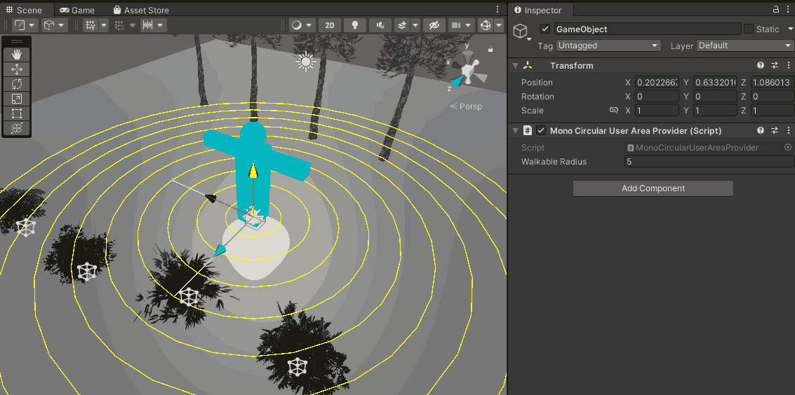
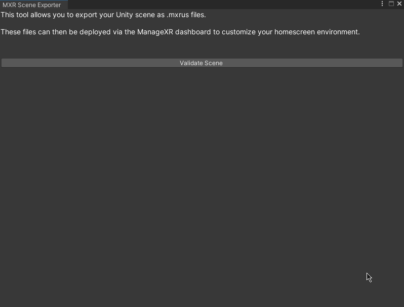

### Start your project
* Create (or open) a Unity project. Ensure the Unity version is _Unity 2021.3 or below_
* Import the URP `12.1.14` package
* Create a URP Asset in your Project view using `Right Click>Create>Rendering>URP Asset (with Universal Renderer)`
* Set the URP Asset in your Graphics Settings by going to `Project Settings>Graphics>Scriptable Render Pipeline Settings`

### Create your environment
* Use the Unity workflow design your scene
* Create a GameObject and add the `MonoCircularUserAreaProvider` component to it.
    * Ensure that Gizmos are enabled in your Scene view. You should see a blue avatar with concentric circles around it.
    * The position and rotation of the avatar determine the location and direction the user will start at.
    * The walkable area shows how far they can walk. Going out of these bounds will fade out the screen.
    * Change the `Walkable Radius` value of the `MonoCircularUserAreaProvider` component. The concentric circles will update to reflect the new value. Set this value to match the area you want the user to be able to walk around in.
  

## Design tips
* Changing your render pipeline to URP may result in some materials turning pink if they're using shaders incompatible with URP (for example the Stardard shader used in Built-In Render Pipeline)
    * To fix this select these materials and click on `Unity toolbar>Edit>Rendering>Materials>Convert Selected Built-in Materials to URP`. Check if the material gets updated correctly, if not, resolve manually.
* Since your Unity scene will run on standalone VR headsets, ensure that the scene is optimized for mobile devices. 
    * Try to keep your triangle count low
    * Use mobile friendly shaders
    * Bake lighting as much as possible
    * Avoid particle systems with high particle count 
    * Try to keep your draw calls/batches low.
    
### Validating and exporting your scene
* Go to `Unity toolbar>MXR>Scene Exporter`. A window titled `MXR Scene Exporter` will open.
* Click on the `Validate` button. This will validate your scene and violations in your scene (if any) will be highlighted. Click on an issue to expand the GameObjects or assets that are causing it.
    * Issues shown in red will _prevent_ export unless you address them
    * Issues shown in yellow are warnings which don't prevent exporting but highlight potential compatibility or performance problems.
    * 
    * To see the full list of validation issues, see the "Limitations" section.
* If you have no export preventing issues, you'll see the `Export Scene` button that will allow you to export the file to your preferred location

### Post Export
After your `mxrus` file is finished building and has exported, you'll see a build report that will show the different assets that have been packaged.
Clicking on these assets will highlight them in your Project view.

By selecting from the asset type dropdown, you can see the different assets that have contributed to the file size. 
  
The ManageXR web console has a size limit on how large mxrus files you can upload.
  
Often times, especially when using third party 3D assets, textures are imported at very high resolutions that add significantly to the file size.

This view can be used to identify assets that are adding significantly to your export size and take file size reductions steps like reducing resolution, increasing compression or removing assets that that don't add much to the visuals.

Tip: The official ManageXR Bungalow scene largely uses low-medium resolution diffuse/albedo textures and relies on lighting for its visuals and aesthetics. It has additional texture maps only for limited objects.
